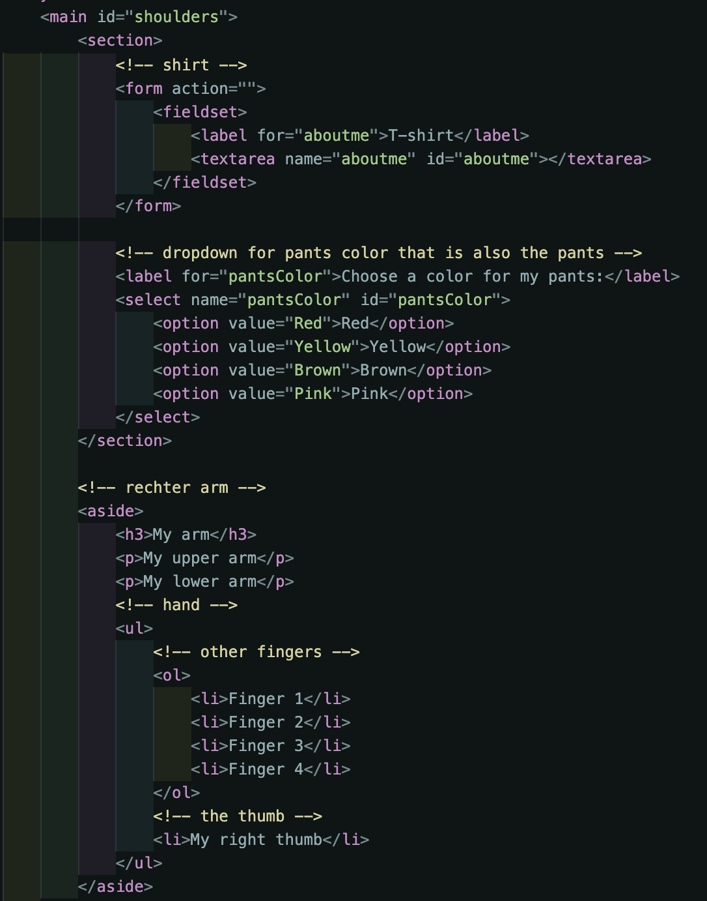
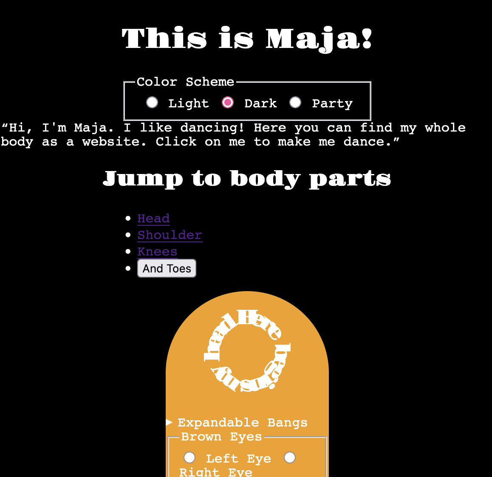
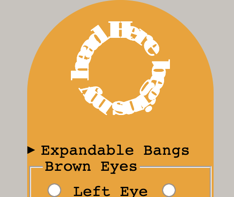
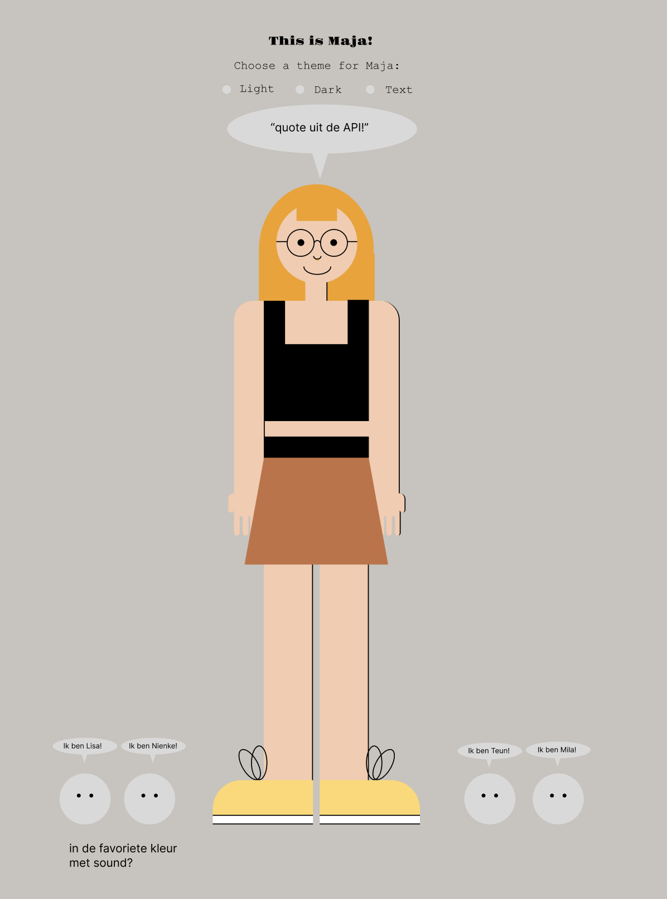
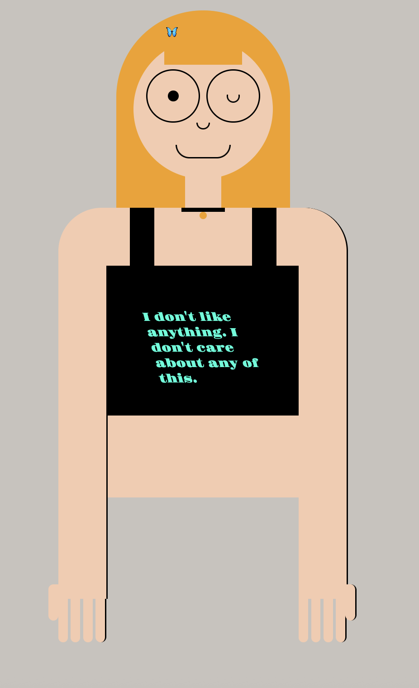
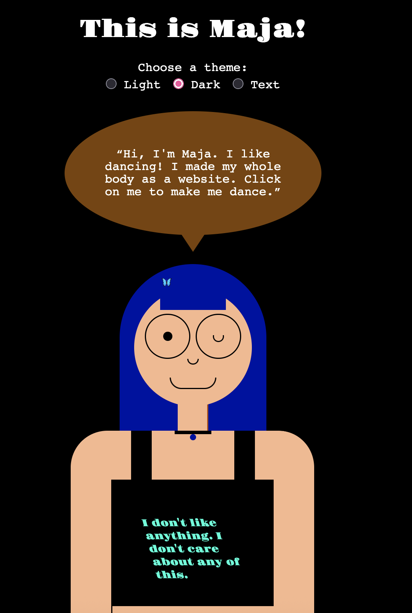
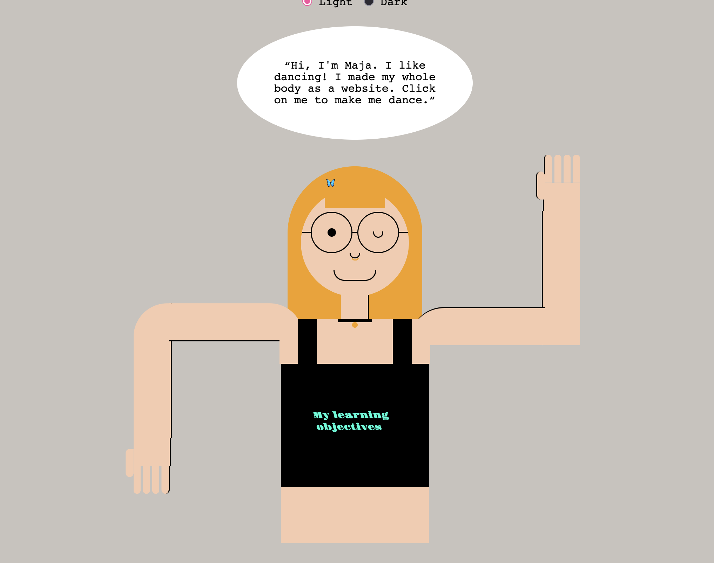
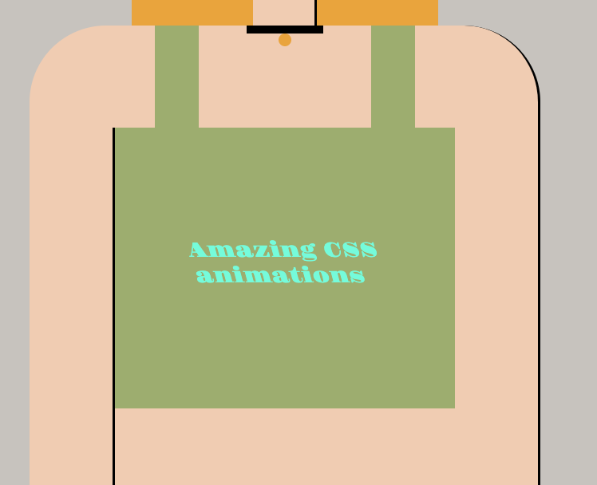
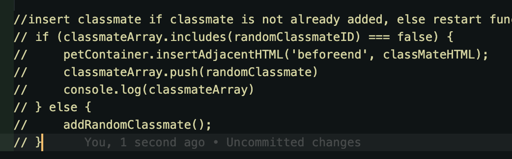

# Sprint0
Sprint 0 opdracht, website over mij, wat ik wil en wat ik kan

## Leerdoelen
- Goed worden in CSS animaties, want die heb ik tijdens mijn coding carrière tot nu toe een beetje genegeerd
- Ik wil websites maken die zowel toegankelijk zijn als ook heel coole vormgeving hebben, want dat vind ik vaak lastig te combineren.
- Goed worden in Javascript en coole interacties kunnen maken, want ik ben niet zo goed in Javascript en voor sommige animaties die ik wil maken heb ik ook Javascript nodig.

# Proces
## Week 1
### Dag 1
Brainstorm, wat ben ik? Wat wil ik leren? Wat staat er in mijn website over mij?

Met oog op mijn leerdoelen heb ik toen bedacht dat ik een spelletje wilde maken, om interactie en javascript te oefenen. Hiervoor had ik alvast een kleine schets gemaakt.

Maar toen kreeg ik feedback dat dit te ingewikkeld zou worden dus toen ben ik meer gaan focusen op mijn andere twee leerdoelen. Hierbij kwam ik uit bij een website waar ik mezelf afbeeld als poppetje, helemaal van semantische HTML-elementen en CSS. En dit op dit poppetje ga ik dan animaties toevoegen, die bij interactie met het poppetje gebeuren.

### Dag 2

- Wat heb ik vandaag gedaan?
  - Workshops Cyd
  - Inspiratie ophalen op pinterest 
  
  - eerste design poppetje
  
  - onderzoek naar semantische HTML elementen en uitzoeken welke ik wil gebruiken
- Hoe lang duurde het?
  - 3 uur
- Wat heb ik geleerd?
  - Ik heb nieuwe HTML elementen leren kennen
- Wat ga ik morgen doen?
  - Uitzoeken welke elementen van het poppetje welke HTML elementen worden en beginnen met code

### Dag 3

- Wat heb ik vandaag gedaan?
  - 2 workshops van Vasilis gevolgd, Theming en HTML rulez
  - Ik ben door een lijst aan HTML elementen gegaan en heb alles opgeschreven wat ik wilde gebruiken. Daarna heb mijn HTML code geschreven op basis van mijn poppetje en als het goed is is elk onderdeel van het poppetje nu een eigen semantisch HTML element.
  
  - beginnetje gemaakt aan dark/light mode
  
  - API werkend gekregen in mijn website, mijn bio wordt nu uit de API gepakt en als <q> element in de website geplaatst
  - gekeken naar text on path
  
- Hoe lang duurde het?
  - 3 1/2 uur aan mijn eigen website werken
- Wat heb ik geleerd?
  - Ik wilde graag text on path en heb daarvoor splitting gebruikt in Javascript en ik begrijp het nog niet helemaal maar langzaam kom ik erachter hoe het moet
- Wat ga ik morgen doen?
  - Verdergaan met basic vormgeving

### Weekly Check-Out

- Hoe ging het?
  De eerste week ging wel goed! Ik was bang dat ik het allemaal te veel zou vinden, maar elke dag ging toch sneller voorbij dan verwacht. Door mijn studentassistentschap vorig block zat de code nog wel in mijn vingers, maar ik heb toch tijdens de workshops deze week al zo veel nieuwe dingen geleerd. En ik ben er super enthousiast over! Ik wil alles eigenlijk meteen toepassen en uitproberen, maar ja, coderen duurt toch langer dan je wil soms. Omdat ik dus allemaal semantische HTML elementen wil stylen als divs, maar ik wel rekening moet houden met hoe ze werken en hoe ik de tekst kan verbergen ben ik heel lang bezig met het stylen en kom niet echt aan andere dingen toe. Maar ik wil volgende week nog wel sneller werken. 

- Leerdoelen
  - Toegankelijkheid en vormgeving
    Hier ben ik wel in gegroeid! Ik heb er heel veel over nagedacht welke HTML elementen ik moet gebruiken, nieuwe HTML elementen leren kenen en heel veel tijd eraan gespendeert om de tekst van de website voor een screenreader logisch en leesbaar te maken maar wel de vormgeving die ik wil mogelijk te maken. Zo veel heb ik hier nog nooit over nagedacht.
  - CSS animaties
    Hier wil ik aan werken als het lukt om op tijd mijn vormgeving af te krijgen.
  - Javascript interacties
    Zijn er nu nog niet. Ga ik in de website zetten als ik nog tijd overheb.

- Volgende week
  Ik wil zo snel mogelijk mijn vormgeving afkrijgen en wat mooier maken dan nu zodat ik nog kan werken aan mijn twee extra styles, de darkmode en de tekst-mode waarin je de tekst van de website kunt lezen. Daarna wil ik hopelijk nog een aantal animaties toevoegen.

## Week 2
### Dag 1 
- Wat heb ik vandaag gedaan?
  - Ik heb erover nagedacht hoe ik data over mijn medestudenten wil toevoegen uit de API. Ik wil kleine huisdieren die de namen van mijn vrienden hebben, in hun favoriete kleur!
    
  - Ik heb de vormgeving van mijn bovenlichaam afgerond
    
  - Ik ben einde van de dag pas klaargeweest met de vormgeving van mijn bovenlichaam dus ik heb besloten om het er even bij te laten. De onderlichaam komt pas zodra ik wat andere, nieuwe, moeilijkere dingen heb gedaan.
  - Ik wilde graag mijn eigen naam uit de API halen, maar ik wilde graag alleen mijn voornaam. Dus ik heb met split gewerkt om een array van mijn naam te maken en alleen de voornaam eruit te halen.
  - Ik heb een heel klein beginnetje gemaakt om een random kleur generator te maken voor mijn t-shirt, maar heb hem nog niet in de website geintegreerd.
  - Ik heb mijn bestaande darkmode verbeterd
      
- Hoe lang duurde het?
  - de hele dag. 9:30 - 16:30
- Wat heb ik geleerd?
  - Array maken van bestaande tekst, verder eigenlijk niet zo veel omdat ik bezig was met opzich bestwel makkelijke vormgeving
- Wat ga ik morgen doen?
  - Eindelijk animaties toevoegen, random kleur selector uitwerken, view transitions hopelijk

### Dag 2
- Wat heb ik vandaag gedaan?
  - workshop typografie en code hygiëne
  - Ik heb vandaag mijn vormgeving een beetje aangepast met ::before en ::after elementen op de bril die ik niet semantisch kon maken
  - Ik heb verder niet echt aan de vormgeving gewerkt en ben eindelijk begonnen met javascript interacties en css
  - Ik heb ervoor gezorgd dat mijn tshirt als je op de shirt-straps klikt van kleur verandert (random) en dat de tekst nog steeds leesbaar blijft, met contrast-color()
  - Ik heb de API data over mijn klasgenoten ingeladen en ze als kleine diertjes in hun favoriete kleur op mijn website laten verschijnen
  - daarnaast heb ik op mijn klasgenoten-huisdieren view transitions toegepast
  - en ik ben begonnen aan een view transition voor de arm.
- Hoe lang duurde het?
  - 4 uur
- Wat heb ik geleerd?
  - View transitions!! die had ik buiten de workshop nog nooit gebruikt en ik vond het wel ingewikkeld in het begin, maar heb wel hulp van Cyd gekregen!
  - ik wist ook niet dat je in CSS constrast-color() kon gebruiken, wat handig! 
- Wat ga ik morgen doen?
  - De animaties van mijn armen afronden en misschien nog wat dingen iets mooier maken dan nu, want ik hou niet zo van de kleuren die ik gebruik

### Dag 3
- Code Review:
  - kijken naar generic to specific, ik weet niet of ik dat goed heb gedaan
  - kijken naar variables in CSS of ik daar ook met nesting kan werken
  - betere comments in javascript 
  - semicolons weg in javascript
  - kijken of let en const allemaal klopt
  - maar ook const voor objecten en arrays ?
  - JS logischer structureren

### Weekly Checkout
Ik heb deze week alles bijna kunnen afronden wat ik wilde doen en heb nu een product waar ik best blij mee ben! Ik wilde heel graag leren hoe ik CSS animaties kon maken waardoor ik poppetjes soortvan realistisch zou kunnen bewegen. En dat is gelukt! Ik heb alles goed genest zodat alle elementen met elkaar meebewegen. 

Ik ben ook blij dat ik nu beter met arrays en objecten kan werken, dus ook met APIs en JSON data. Ik heb hier weleens mee gewerkt en hierover geleerd maar ik moest toch steeds elke stap opnieuw opzoeken omdat ik het toch niet helemaal snapte. En nu voelt het eindelijk alsof ik de basics gewoon snap en er redelijk me om kan gaan zonder steeds alles opnieuw op te zoeken. Daar ben ik blij mee! Javascript begint steeds makkelijker te worden.

Mijn hoofduitdaging was natuurlijk toegankelijkheid, maar dat is toch waar ik uiteindelijk toch niet zo blij mee ben. Ik had minder tijd voor vormgeving dan ik wilde, en ik vond het lastig om een ontwerp te maken waar echt alle contrasten hoog genoeg zijn. Verder wilde ik natuurlijk wel een screen-reader friendly website, maar of het nou echt zo logisch is dat er meerdere uls in elkaar staan die aangeven dat ze vingers zijn weet ik niet. Ook is het waarschijnlijk niet super toegankelijk als ik data die belangrijk is om te lezen steeds dynamisch verander, want dat is vast niet zo leuk voor een screenreader. De footer is niet echt een footer met links.... allemaal dat soort dingen. 
Ik had ook een css functie toegevoegd om ervoor te zorgen, dat de tekst op de t-shirt ook bij veranderede kleur leesbaar blijft, maar dat werkt in in Chrome en daar werd ik echt gek van. Ik wou dat er maar 1 browser was...

Verder wilde ik deze week eigenlijk nog eraan werken dat je alle klasgenoten maar één keer als huisdier kan plaatsen op mijn website. Maar dat wilde gewoon niet lukken! Ik was wel blij met wat ik had bedacht, maar er zat te veel recursion in blijkbaar, dus wilde de functie niet meer dan 1 keer opstarten. Dat was jammer. En het is me niet gelukt om dat op te lossen. Dat zou ik eigenlijk nog heel graag willen doen.

Met wat meer tijd zou ik ook gewoon nog verder gaan met de vormgeving en vooral meer moeite doen voor de klasgenoten huisdieren, want die zijn nu een beetje lelijk. En gewoon nog wat meer animaties en interacties toevoegen. Maar ja, je kunt altijd doorgaan. :)

Bij de code review was me opgevallen dat ik (in hoeverre ik dat zelf kan beoordelen) best goed op weg ben met de codeconventies! Mijn html was best netjes, mijn css kon wel beter maar was ook wel goed, alleen mijn javascript kon nog wat beter geordent. Daar was ik blij mee! Het kan natuurlijk altijd beter maar het was goed om te zien dat ik wel al goed op weg ben.

# Bronnen
Alle HTML tags https://www.w3schools.com/tags/default.asp
CSS animaties https://miocene.io/post/css-character-skeleton/
Design inspiratie https://nl.pinterest.com/ginchanah/sprint0-inspiratie/
Positioning text along a path https://css-irl.info/positioning-text-along-a-path-with-css/
Split text with javascript https://www.w3schools.com/jsref/jsref_split.asp
CSS random color https://stackoverflow.com/questions/1484506/random-color-generator
CSS property set in javascript https://stackoverflow.com/questions/5195303/set-css-property-in-javascript
Automatische contrast color https://developer.mozilla.org/en-US/docs/Web/CSS/Reference/Values/color_value/contrast-color
Random array value https://stackoverflow.com/questions/4550505/getting-a-random-value-from-a-javascript-array
View transitions https://codepen.io/Sidstumple/pen/dPXmGaX

