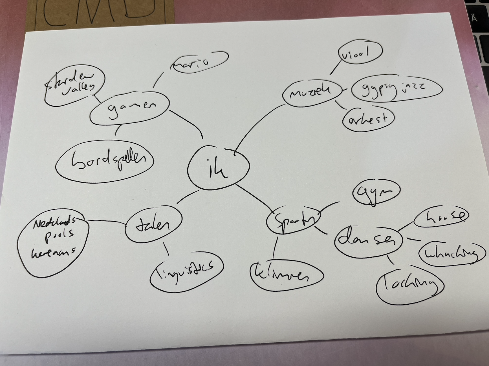
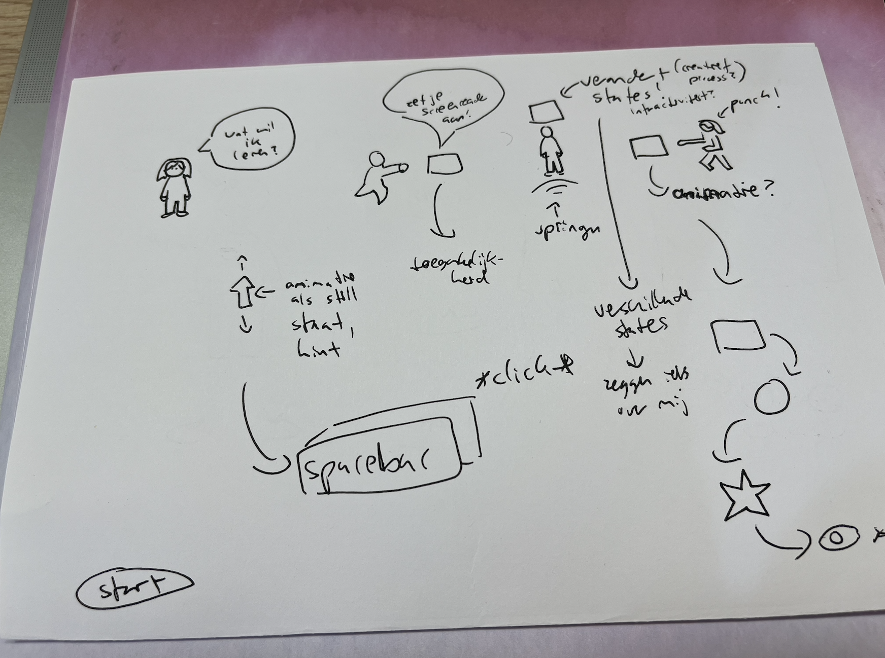
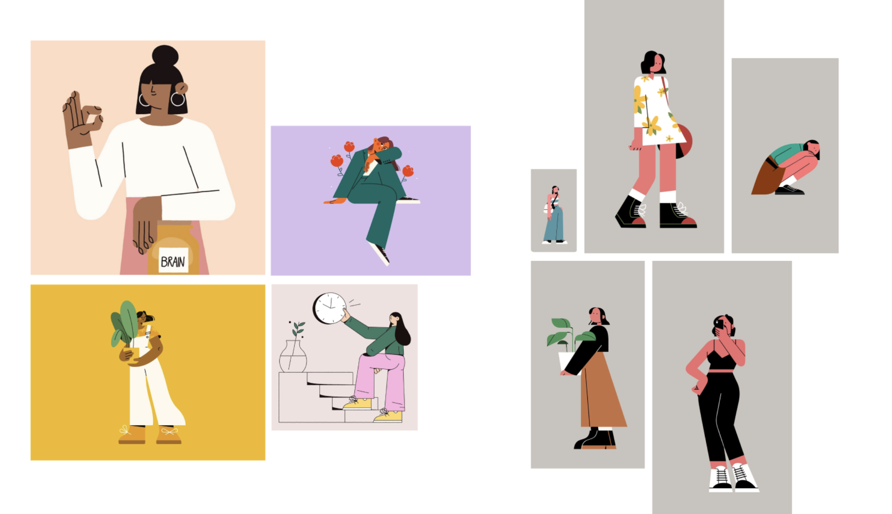
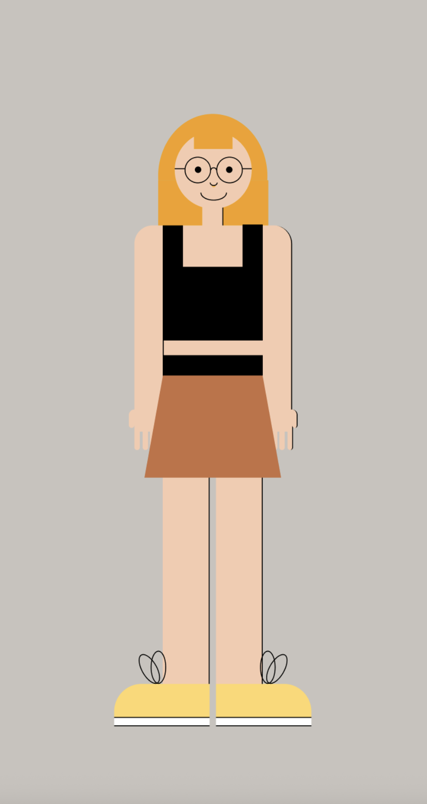

# Sprint0
Sprint 0 opdracht, website over mij, wat ik wil en wat ik kan

## Leerdoelen
- Goed worden in CSS animaties, want die heb ik tijdens mijn coding carrière tot nu toe een beetje genegeerd
- Ik wil websites maken die zowel toegankelijk zijn als ook heel coole vormgeving hebben
- Goed worden in Javascript en coole interacties kunnen maken

## Proces
### Dag 1
Brainstorm, wat ben ik? Wat wil ik leren? Wat staat er in mijn website over mij?

Met oog op mijn leerdoelen heb ik toen bedacht dat ik een spelletje wilde maken, om interactie en javascript te oefenen. Hiervoor had ik alvast een kleine schets gemaakt.

Maar toen kreeg ik feedback dat dit te ingewikkeld zou worden dus toen ben ik meer gaan focusen op mijn andere twee leerdoelen. Hierbij kwam ik uit bij een website waar ik mezelf afbeeld als poppetje, helemaal van semantische HTML-elementen en CSS. En dit op dit poppetje ga ik dan animaties toevoegen, die bij interactie met het poppetje gebeuren.

### Dag 2

- Wat heb ik vandaag gedaan?
  - Workshops Cyd
  - Inspiratie ophalen op pinterest 
  
  - eerste design poppetje
  
  - onderzoek naar semantische HTML elementen en uitzoeken welke ik wil gebruiken
- Hoe lang duurde het?
  - 3 uur
- Wat heb ik geleerd?
  - Ik heb nieuwe HTML elementen leren kennen
- Wat ga ik morgen doen?
  - Uitzoeken welke elementen van het poppetje welke HTML elementen worden en beginnen met code

 

## Bronnen
Alle HTML tags https://www.w3schools.com/tags/default.asp
CSS animaties https://miocene.io/post/css-character-skeleton/
Design inspiratie https://nl.pinterest.com/ginchanah/sprint0-inspiratie/

